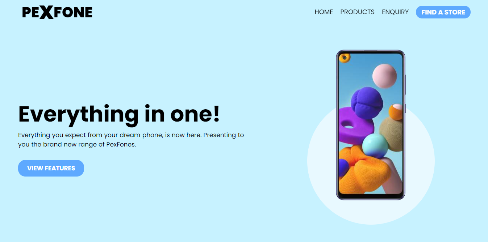

# Pexfone

## Overview
* A sample website for a fictional mobile brand __Pexfone__ to be submitted as a mini-project at [Parvatibai Chowgule College](http://www.chowgules.ac.in/) for the following courses:
  + Web Designing (Semester 3)
  + Server Side Programming (Semester 4)
* Mobile responsive (mostly).
* Done using plain HTML, CSS, Js.
* Icons from [FontAwesome](https://fontawesome.com/).
* Imagery from [Unsplash](https://unsplash.com/) and [Samsung](https://www.samsung.com/in/smartphones/galaxy-a/).
---
## Preview

---
## Important links
* [GitHub Repo](https://github.com/pexeixv/pexfone)
* [Live Website](https://wd.gavinpereira.in/)
--- 